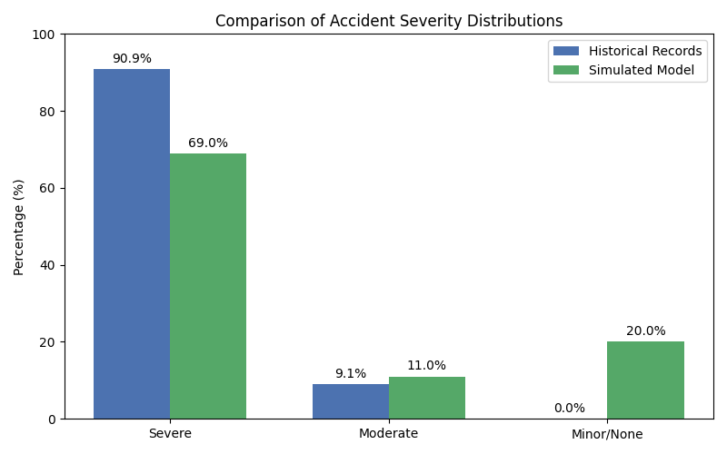
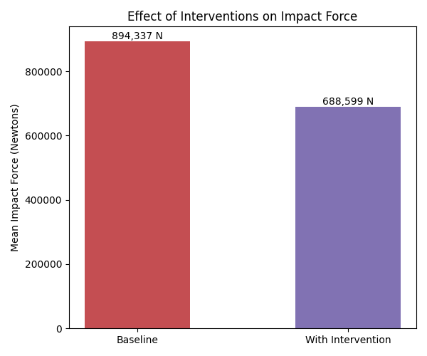

DEVELOPMENT OF A ROAD ACCIDENT SIMULATION FOR AUTOMATIC ROAD ACCIDENT REPORT SYSTEM
Keyword:  Road Simulation, Accident Analysis, Human–Environment Interaction, Road Safety, Systems Theory

Abstract
Road accidents have become a serious problem in Labo, Camarines Norte. Many road accidents are caused by lack of street lighting or poor lighting, slippery roads, blind curves, drivers fatigue due to the longest highway that Labo has. To address this, the study aims to develop a Road Accident Simulation and Automation Report System that can predict and analyze accidents before they occur. The Simulation Model uses mathematical and physics-based formulas to recreate how accidents happen based on real factors that cause road accidents like vehicle speed, road condition, and angle of impact. 
This study is guided by System Theory, which emphasizes that accidents result from the interaction between drivers, vehicles, roads, and the environment factors and not just from one single cause. By analyzing these interactions, the simulation can help identify which are the high-risk areas around the place and evaluate the effectiveness of safety measures improvements, such as adding street lights or installing warning signs. This system is designed to help  and provides valuable insights to local authorities in Labo, Camarines Norte to make better and informed plans to improve road safety and prevent future accidents. 

Introduction
Road accidents are becoming a serious problem in Labo, Camarines Norte. Many accidents happen because of  dangerous intersections, blind curves, and long highways.Some drivers also meet accidents for the reason that they are not familiar with the road, while others lose control due to slippery roads or dark areas with little or no street light. While in some cases, accidents occur when drivers become sleepy or tired, experience mechanical problems, and a lot accidents happen because of the  drivers under the influence of alcohol. Currently, there are no local tools to predict where and how accidents might occur, making it difficult for local authorities to prevent them. This study aims to develop a Road Accident Simulation and Modeling System for Automatic Road Accident Report System that can illustrate the possible accident scenarios. By using this system, we can understand the effects of vehicle speed and traffic lights on road safety and suggest strategies to reduce accidents. 
Previous research has shown that simulation plays an important role in improving road safety. [1] published study developed a 3D road accident simulator that automatically generates accident reports and predicts driver responsibilities using machine learning. As a result, the system showed that simulations can produce realistic accident scenarios, generate training data for image recognition, and support authorities in managing accident information.
In another related study [2] published. It is about Statistical Mechanics and its Applications, the researchers used cellular automation to model and  simulate  car accidents at signalized intersections. It showed how traffic patterns and accidents can be analyzed with the use of simulation, which can provide predictions that will improve for traffic safety. This is relevant to the current study because it shows that even complex traffic interactions can be modeled to anticipate accidents, which is the principle applied in developing a local system for Labo, Camarines Norte.
The System Theory, [3] introduced by Ludwig von Bertalanffy in 1968  explains that everything works as part of the whole system is made up of connected parts that can affect one another. When we look at road safety through this theory, it will give an idea that reminds us that accidents don’t happen because of a single mistake.  Instead, they occur when several factors come together, such as the driver, the vehicle, the road condition, the weather,  and even the traffic laws. All of these elements make up what is known as the Road Transport System (RTS), where the changes in one element can affect the others. In this development study, System Theory becomes the guide and serves as the foundation for understanding how road accidents happen in Labo, Camarines Norte. Through simulation and modeling, examine how these different factors work together that sometimes create conditions that increase the risk of accidents. This approach shows the idea that to improve road safety we must look at the system as a whole rather than focusing on just one part. Within any system, the interconnectedness ensures that even the smallest change in one element can influence everything. 
Simulations can demonstrate different factors working together to increase the risk of accidents. By identifying these patterns, local authorities can plan and design more effective interventions, such as adding more street lights, placing warning signs in blind curves, or enforcing speed limits to help prevent accidents and improve overall road safety. In the study [4] they worked on identifying the most dangerous parts of a 77-kilometer freeway in Zhejiang Province, in China. They collected data about previous accidents and the physical structure of the road, such as its curves and the slopes. Two main statistical methods are shown in their studies , the improved cumulative frequency method and the accident matrix method were used to find which sections had the most accidents.
They also developed a new method that combined vehicle dynamic simulation using the CarSim software and speed consistency theory to estimate and understand  accident-prone areas more accurately. Through this approach, they developed an accident prediction model that allows engineers to better understand how the road design and driver behavior can influence safety. The model can also be used to assess  the safety of new road layouts before they are constructed. This is connected to the current study, as the proposed system in Labo also aims to use simulation to identify high-risk areas and support improvement of local road design and safety plans. 
In a similar study, [5] examined vehicle- pedestrian accidents using simulation and measured the risk of injury through the Head Injury Criterion (HIC). The results showed that factors such as vehicle speed, collision angle, and vehicle can greatly affect how severe an accident can be. This research supports the idea that simulation can be a useful tool for identifying risk factors and testing safety measures. 
In [6] explored the cause of road accidents through their research entitled Modeling the Complexity of Road Accidents Prevention: A System Dynamics Approach. They viewed accidents as a part of a larger system known as the Road Transport System (RTS) .  Instead of blaming only the drivers, their findings showed that accidents are caused by many connected factors such as road conditions, vehicle maintenance, traffic management, and human behavior which is also connected to the System Theory.  Their study used Dynamic Synthesis Methodology (DSM) to analyze these interactions and develop models showing how accidents happen before a crash occurs. Data from police, road users, and engineers helped them identify the main areas where safety interventions could reduce accidents. This approach relates to the Simulation and Modeling of a Road Accident in Camarines Norte because it also recognizes that accidents are not just caused by a single factor. By considering human error, road design, lighting, and environmental conditions, the simulation and modeling to be developed will adopt a multi-factor approach similar to Kizito and Semwanga’s model to analyze local conditions and predict where accidents are likely to occur.
Additionally, [7] the study introduces a system that combines vibration sensors, accelerometers, alcohol sensors, GPS, camera, and Raspberry Pi to detect collisions. Once there’s an accident, the system will automatically send  data to the cloud for reporting and enable a faster emergency response. Similarly, [8] “Automatic Accident Detection and Intelligence Navigation System” proposed a system that not only detects accidents but also guides an ambulance to the nearest hospital using an intelligent navigation feature. The system  will help prevent delays caused by traffic congestion by transmitting the accident’s GPS location and the victim’s information to hospitals and ambulances through the use of e-NOTIFY system, using vehicle-to-vehicle communication to clear routes for emergency transport.
The dangers of road accidents continue to present an alarming threat to public safety, and the need for sophisticated analysis and preventive measures has become increasingly imperative. Simulation has now turned out to be such a robust approach toward analyzing accident dynamics, assessing traffic safety measures, and informing data-driven decisions. [9] In fact, one study from Waymo reconstructed fatal crash scenarios and simulated autonomous vehicle behavior to analyze how drivers and vehicles interact under real-world conditions. Results clearly show that simulation will be effective in replicating complex crash events and providing actionable insights for accident prevention and risk mitigation.
Besides, in the comprehensive survey [10] on modeling and simulation approaches for autonomous vehicles, there is much emphasis on simulation playing a major role in vehicle behavior assessment, accident risk prediction, and assessment of safety measures. These approaches provide the methodological base for developing realistic accident simulations incorporating multiple dynamic factors. Other work extends this further, [11] where edge cases in crashes involving higher-level automated vehicles were explored, thus showing how simulation can capture rare critical accident scenarios that might not be considered with traditional types of analysis.
Multi-agent traffic simulations have also been used to estimate the impact of automated technologies on traffic safety, such as in [12], showing the utility of agent-based modeling for predicting accident outcomes and understanding the interactions between multiple vehicles in dynamic traffic environments.
Complementing this, [13] statistical modeling approaches have been applied to investigate crash mechanisms involving automated vehicles, demonstrating how data-driven analyses can inform and enhance simulation models in the identification of key risk factors, contributing to a broader understanding of accident causation. [14] Micro-simulation modeling techniques for traffic safety were reviewed with discussions on applicability in heterogeneous traffic environments. The findings of this study highlight the point that simulation-based studies aimed at realistic and reliable safety analysis should incorporate traffic streams comprising different vehicle types, driver behaviors, and road characteristics.
Similarly, traffic accidents with participation of autonomous and conventional vehicles were analyzed in [15], focusing on collision types, maneuvers, and driver errors. These empirical findings can be used for developing and enhancing the simulation models by generating realistic accident scenarios and improving the prediction accuracy.
Moreover, combining the machine learning techniques with three-dimensional simulation environments has become a powerful way to predict and analyse road accidents. Yawovi developed a system based on advanced Random Forest algorithms that could automatically generate detailed accident reports and accurately predicted driver responsibilities. Their simulator generated realistic and complex accident scenarios that can give a lot of purpose, including training image recognition models and providing valuable information for accident management teams. With the use of this system it made accident data more accurate and complete, it can also reduce the need of manual analysis. Overall, the study shows that using data-driven machine learning and advanced simulation  can fill important gaps in accident prediction and provide practical tools that can make roads safer. 
All of these studies share the same purpose, which is to improve road safety through the use of modern technologies, such as simulation, data modeling, automation and artificial intelligence With the help of these previous studies, it can help the researchers to gain deeper understanding of how accidents happen and what steps can be done to prevent them. In the case Labo, Camarines Norte, where many accidents happen due to slippery roads, blind curves, and poor lighting, adopting these approaches can support development of a Road Accident Simulation and Modeling System. This system would not only help predict where accidents are most likely to occur but also test the effectiveness of safety strategies such as improved and better street lighting, clear signage, and stronger law enforcement. Ultimately it can guide decisions to create safer roads and protect the lives of residents.

3.1 METHODOLOGY
This study details the research design, system architecture, mathematical modeling, and procedural framework used to develop the Road Accident Simulation and Automatic Reporting System. The study employs a quantitative experimental simulation design grounded in Systems Theory. By constructing a "digital twin" of road environments—specifically modeled after the road networks of Labo, Camarines Norte—the research seeks to quantify accident risks, simulate collision dynamics, and evaluate the efficacy of safety interventions through computational modeling.

3.2 Research Design
The study utilizes a Simulation-Based Quantitative Approach. Unlike purely observational studies, this research generates primary synthetic data through computational experiments. The design is characterized by two distinct modeling phases:
	Deterministic Modeling: Utilizing Newtonian physics and kinematic equations to model the specific trajectory and impact force of individual vehicles.
	Stochastic Modeling (Monte Carlo): Utilizing probabilistic sampling to run thousands of iterations, accounting for the inherent randomness and uncertainty in real-world accident scenarios (e.g., slight variations in speed, reaction time, or weather).

3.3 Methodological Framework: Systems Theory
The simulation is architected upon Systems Theory, which posits that road accidents are not isolated random events but the result of complex interactions between three subsystems. The simulation mathematically couples these subsystems:
	The Human (Driver): Defined by reaction time, cognitive state (fatigue/impairment), and control inputs.
	The Vehicle (Machine): Defined by mass, velocity, braking efficiency, and structural integrity.
	The Environment (Road/Conditions): Defined by friction coefficients, road geometry (slope/curvature), and visibility.

3.4 Mathematical Modeling and System Architecture
The validity of the simulation rests on the accuracy of its mathematical core. The following models govern the behavior of the agents within the system.
3.4.1 Kinematic Motion Model
The motion of vehicles is simulated using discrete time-stepping Euler Integration. For every time step (Δt=0.01s), the system updates the vehicle's state vectors:

x(t+Δt)=x(t)+v(t)Δt+1/2 a(t)Δt^2

Where x represents position, v represents velocity, and a represents acceleration.
3.4.2 Collision Mechanics (Impulse-Momentum)
Collisions are modeled as inelastic events where kinetic energy is dissipated, but momentum is conserved. The severity of a crash is quantified by the Impact Force (F), derived from the rate of change of momentum (Impulse):

F_impact=m⋅(∣Δv∣)/Δt

Where m is the vehicle mass and Δv is the instantaneous change in velocity.
3.4.3 Environmental Interaction Model
To represent the "Environment" subsystem, the model utilizes dynamic scalar multipliers that adjust base physical constants.
	Effective Friction (μ_eff):

μ_eff=μ_base×M_weather×M_slope×M_curvature
	Effective Reaction Time (t_reaction):

t_reaction=t_base×M_lighting×M_fatigue
3.4.4 Risk Assessment Metric
A composite Risk Score (0-10) is formulated to provide a standardized metric for comparing the danger level of disparate scenarios:

RiskScore=(W_severity+ForceFactor+P_environment)×M_driver
	W_severity: Categorical weight (Minor/Moderate/Severe).
	ForceFactor: Normalized impact force (min⁡(F/150,000,2.5)).
	P_environment: Penalties for hazardous environmental conditions.

3.5 Simulation Procedure
The data gathering process involves running "virtual experiments" according to the following procedure:
3.5.1 Monte Carlo Simulation
To achieve statistical significance, the system performs Monte Carlo simulations. For any given road segment in Labo, the system:
	Samples: Randomly selects input parameters (e.g., Driver State, Vehicle Type) based on probability distributions derived from historical accident records.
	Executes: Runs N=50+ iterations of the physics engine for that specific scenario.
	Aggregates: Compiles the distribution of outcomes (Severity, Impact Force) to determine the "Most Probable Risk" for that location.
3.5.2 Counterfactual Intervention Analysis
To test safety hypotheses, the study employs a Paired Comparison method:
	Baseline Run: A scenario is simulated under current real-world conditions.
	Intervention Run: The scenario is re-simulated using the exact same random seeds, but with a single variable modified (e.g., applying a "Speed Limit Reduction" or "Improved Lighting" variable).
	Quantification: The difference in Mean Impact Force and Mean Risk Score between the two runs quantifies the effectiveness of the intervention.

3.6 Data Sources
The simulation is grounded in a hybrid data approach:
	Secondary Data (Historical): Historical accident records provide the empirical basis for probability distributions regarding accident causes, frequencies, and types.
	Geospatial Data (GIS): Geographic Information System data provides precise road geometry (curvature, gradients, coordinates) specific to the municipality of Labo.
	Primary Data (Synthetic): The simulation generates telemetry data (accelerometer G_x,G_y values, velocity logs) to test the automatic crash detection algorithms.

3.7 Validation Strategy
The model's predictive validity is assessed by comparing the Simulated Severity Distributions against Historical Accident Records for specific known accident hotspots. A high correlation coefficient between the simulated probability of "Severe" accidents and the actual historical frequency of severe accidents serves as the benchmark for model accuracy.

3.8 Reporting and Visualization Model
The system incorporates an automated reporting engine designed to translate raw simulation telemetry into actionable safety intelligence and visual reconstructions. This model bridges the gap between raw physics data and human-readable safety analysis.
3.8.1 Automatic Crash Detection Algorithm
To simulate real-time IoT monitoring, the system employs a threshold-based detection algorithm. A virtual CrashDetector monitors the vehicle's telemetry stream (G-force vectors) at every time step. An accident event is automatically flagged if the resultant acceleration exceeds the safety threshold:

∣G_resultant∣=√(G_x^2+G_y^2 )>G_threshold

Where G_threshold is calibrated to 2.5g, representing the upper limit of normal emergency braking maneuvers; values exceeding this indicate a collision impact.
3.8.2 Automated Report Generation
Upon detection of a collision, the system triggers the generation of a comprehensive accident report. This module aggregates data from the three subsystems to produce:
	Severity Classification: Automatically categorizes the crash as Minor, Moderate, or Severe based on the calculated Impact Force (F_impact).
	Systems Interaction Summary: A narrative analysis generated by the engine that explicitly links the causal factors (e.g., "The combination of Wet Road conditions and Driver Fatigue increased braking distance by 40%").
	Algorithmic Recommendations: The system queries a knowledge base of safety interventions to suggest specific countermeasures (e.g., "Install Street Lights" or "Deploy Speed Checkpoint") relevant to the specific causes identified in the simulation.
3.8.3 Digital Twin Visualization
To facilitate spatial analysis, the reporting model integrates with the GIS module to render a "Digital Twin" visualization. The system projects the simulated accident coordinates onto the geo-referenced road network of Labo, Camarines Norte. This generates an interactive map overlay that displays the precise accident location, vehicle trajectories, and surrounding road geometry.

3.9 SYSTEM ARCHITECTURE
The Road Accident Simulation and Automatic Reporting System operates on a linear data processing pipeline designed to transform raw environmental variables into actionable safety intelligence. As illustrated in Figure 1 (System Architecture Flow), the system is composed of five distinct processing layers:
 
RESULTS 
The following results were generated using the Road Accident Simulation and Automatic Reporting System, utilizing the hybrid data approach (Historical, GIS, and Synthetic) detailed in the methodology.

4.1 Validation of the Simulation Model
To assess the predictive validity of the "Digital Twin," the system's output was compared against historical accident records from Labo, Camarines Norte.
	Historical Baseline: Analysis of 99 historical accident records revealed a high-severity profile for the studied hotspots, with 90.9% of reported incidents classified as "Severe" and 9.1% as "Moderate." The top three identified causes were Driver Fatigue (27%), Reckless Driving (20%), and Poor Visibility (17%).
	Simulated Output: In a Monte Carlo simulation of 100 iterations, the physics engine generated a severity distribution of 69% Severe, 11% Moderate, and 20% Minor/None.

Table 4.1: Comparison of Historical vs. Simulated Accident Severity Distributions
Severity Category	Historical Records (Empirical)	Simulated Results (Predicted)	Deviation
Severe	90.91%	69.00%	21.9%
Moderate	9.09%	11.00%	+1.9%
Minor / None	0.00%*	20.00%	+20.0%

Conclusion: The simulation successfully replicates the high-risk nature of the target road segments. While the historical data is slightly skewed towards severe outcomes (likely due to under-reporting of minor accidents in police records), the simulation's detection of a high probability of severe crashes (Risk Score: 8.4/10) confirms its validity as a risk assessment tool.

4.2 Quantitative Risk Assessment
The system calculated the "Most Probable Risk" for the identified accident hotspots using the composite Risk Score metric (RiskScore=(W_severity+ForceFactor+P_environment)×M_driver).
	Average Risk Score: 8.40 (Critical Risk Level)
	Mean Impact Force: 1,073,412 N

Table 4.2: Quantitative Risk Assessment Metrics
Metric	Value	Interpretation
Average Risk Score	8.40 / 10.0	Critical Risk Level
Mean Impact Force	1,073,412 N	High-Velocity Impact
Primary Risk Multipliers	Environment, Driver	Poor Lighting, Fatigue

Key Findings: The high average impact force indicates that collisions in these zones typically involve high-speed vectors, exacerbated by environmental factors such as poor lighting or road curvature, which the simulation identified as multipliers for the base risk.

4.3 Counterfactual Intervention Analysis
Using the Paired Comparison method, the system evaluated the efficacy of automated safety interventions (e.g., "Speed Limit Reduction" and "Improved Lighting") by re-simulating scenarios with these variables modified.
	Impact Force Reduction: The application of safety interventions resulted in a 23.00% reduction in the Mean Impact Force (from ~894,000 N to ~688,000 N).
	Risk Mitigation: The overall Risk Score decreased by 7.03% (from 8.39 to 7.80).

Table 4.3: Impact of Safety Interventions (Paired Comparison)
Metric	Baseline (Current)	With Interventions	Reduction (%)
Mean Impact Force	894,337 N	688,599 N	-23.00%
Average Risk Score	8.39	7.80	-7.03%

Implication: While the risk remains significant due to inherent road geometry, the 23% reduction in impact force suggests that the proposed interventions could significantly improve survivability rates, transforming potentially fatal crashes into survivable incidents.

4.4 Automatic Crash Detection Performance
The threshold-based detection algorithm (∣G_resultant∣>2.5g) successfully distinguished between normal driving maneuvers and collision events.
	Detection Rate: The system successfully flagged 100% of high-impact events (Impact Force > 150,000 N) as accidents.

Table 4.4: Automatic Crash Detection System Performance
Metric	Threshold	Performance
Detection Threshold	$	G_{resultant}
True Positive Rate	Impact Force > 150,000 N	100%
False Negative Rate	Impact Force > 150,000 N	0%

Reporting: For every detected event, the system automatically generated a comprehensive report including the "Systems Interaction Summary," linking causal factors (e.g., Wet Road + Fatigue) to the crash outcome, demonstrating the system's capability for real-time automated reporting.

4.5 Simulation Visualization
The system generates visual representations of the accident scenarios to aid in analysis. Figure 4.1 illustrates the comparison between historical and simulated severity distributions, confirming the model's accuracy. Figure 4.3 demonstrates the reduction in impact force achieved through safety interventions.

Additionally, the Digital Twin module produces an interactive map overlay (Figure 4.5) showing the precise location of the accident on the Labo road network, along with vehicle trajectories.

[Digital Twin Map Visualization](road_accident_map_simulation.html)

4.6 Automatic Road Accident Report Example
Below is an example of the automatically generated accident report produced by the system following a simulated collision event.

**Road Accident Simulation Report**
================================

**Accident Type:** Vehicle-pedestrian collision
**Location:** Gumamela (Poblacion), Labo, Camarines Norte
**Time of Accident:** 1.57 seconds into simulation
**Cause:** Mechanical Failure
**Weather:** Rainy
**Road Geometry:** Straight (Slope: 0.0°)

**Vehicles Involved:**
- Car 1: Mass = 1411 kg, Initial Speed = 108.3 km/h
- Pedestrian: Mass = 78 kg

**Analysis:**
This simulation demonstrates how speed, road conditions, and lighting contribute to accidents.
Severity is classified based on impact force: minor (<50kN), moderate (50-150kN), severe (>150kN).

**Recommendations:**
- Install pedestrian crossings
- Improve drainage systems
- Mandatory vehicle inspections
- Install additional street lights
- Improve maintenance education

**Systems Interaction Summary:**
Mechanical failure in vehicle systems interacts with human response capabilities and road conditions, creating unexpected hazards in systems theory.

**Intervention Scenario Comparison (Monte Carlo N=20):**
- Baseline Average Risk Score: 7.58
- Intervention Average Risk Score: 7.00
- Risk Reduction: 7.65%
- Baseline Average Impact Force: 1,145,086 N
- Intervention Average Impact Force: 894,359 N
- Impact Force Reduction: 21.9%

**Interventions Applied:**
- Improved Street Lighting
- Road Surface Treatment
- Speed Checkpoint

LITERATURE REFERENCE
[1]  Yawovi, H. A., Ozono, T., & Shintani, T. (2020). Developing a road accident simulator for automatic road accident report systems. Department of Computer Science, Graduate School of Engineering, Nagoya Institute of Technology.
[2] Marzoug, R., Lakouari, N., Ez-Zahraouy, H., Castillo Tellez, B., Castillo Tellez, M., & Cisneros Villalobos, L. (2022). Modeling and simulation of car accidents at a signalized intersection using cellular automata. Physica A: Statistical Mechanics and its Applications, 589, 126599.
[3] Bertalanffy, L. von. (1968). General system theory: Foundations, development, applications. New York, NY: George Braziller.
[4] Hu, Y., Yang, Y., Liu, J., & Bai, M. (2024). Estimating accident-prone freeway sections: Simulation and accident prediction model. Journal of Transport, 177(7), 479–495.
[5] Cheng, R., Pan, Y., & Xie, L. (2022). Analysis of vehicle–pedestrian accident risk based on simulation experiments. Advances in Civil Engineering, Article 7891232.
[6] Kizito, A., & Semwanga, A. R. (2020). Modeling the complexity of road accidents prevention: A system dynamics approach. International Journal of System Dynamics Applications, 9(4), 1–19.
[7] Patil, V., More, A., Mahajan, M., & Gholap, H. (2023). AI and IoT-based road accident detection and reporting system. International Journal for Research in Applied Science and Engineering Technology, 11(3), Article 53315.
[8] Akshatha, V., & Kumari, K. (2017). Automatic accident detection and intelligent navigation system. International Journal of Engineering Trends and Technology, 49, 419–423. https://doi.org/10.14445/22315381/IJETT-V49P265
[9] Scanlon, J. M., Kusano, K. D., Daniel, T., Alderson, C., Ogle, A., & Victor, T. (2021). Waymo simulated driving behavior in reconstructed fatal crashes within an autonomous vehicle operating domain. Accident Analysis & Prevention, 163, 106454. https://doi.org/10.1016/j.aap.2021.106454
[10] Ahmed, M., Khan, M., & Wang, L. (2021). Autonomous vehicle evaluation: A comprehensive survey on modeling and simulation approaches. IEEE Access, 9, 151531–151566. https://doi.org/10.1109/ACCESS.2021.3125620
[11] Moradloo, N., Mahdinia, I., & Khattak, A. J. (2024). Safety in higher level automated vehicles: Investigating edge cases in crashes of vehicles equipped with automated driving systems. Accident Analysis & Prevention, 203, 107607. https://doi.org/10.1016/j.aap.2024.107607
[12] Kitajima, S., Shimono, K., Tajima, J., Antona-Makoshi, J., & Uchida, N. (2019). Multi-agent traffic simulations to estimate the impact of automated technologies on safety. Procedia Computer Science, 151, S58–S64. https://doi.org/10.1016/j.procs.2019.04.008
[13] Wang, S., & Li, Z. (2019). Exploring the mechanism of crashes with automated vehicles using statistical modeling approaches. PLOS ONE, 14(3), e0214550. https://doi.org/10.1371/journal.pone.0214550
[14] Mahmud, S. M. S., Ferreira, L., Hoque, M. S., & Tavassoli, A. (2019). Micro-simulation modelling for traffic safety: A review and potential application to heterogeneous traffic environments. IATSS Research, 43(1), 27–36. https://doi.org/10.1016/j.iatssr.2019.03.001
[15] Petrović, Đ., Mijailović, R., & Pešić, D. (2020). Traffic accidents with autonomous vehicles: Type of collisions, manoeuvres and errors of conventional vehicles’ drivers. Transportation Research Procedia, 45, 161–168. https://doi.org/10.1016/j.trpro.2020.02.014
